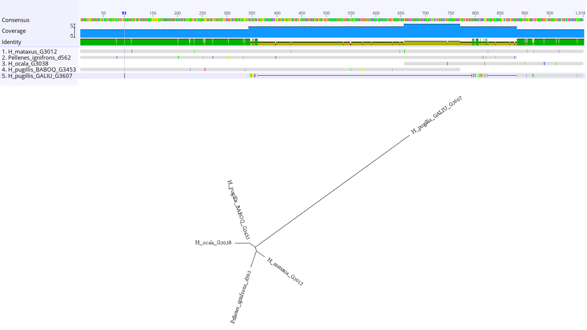
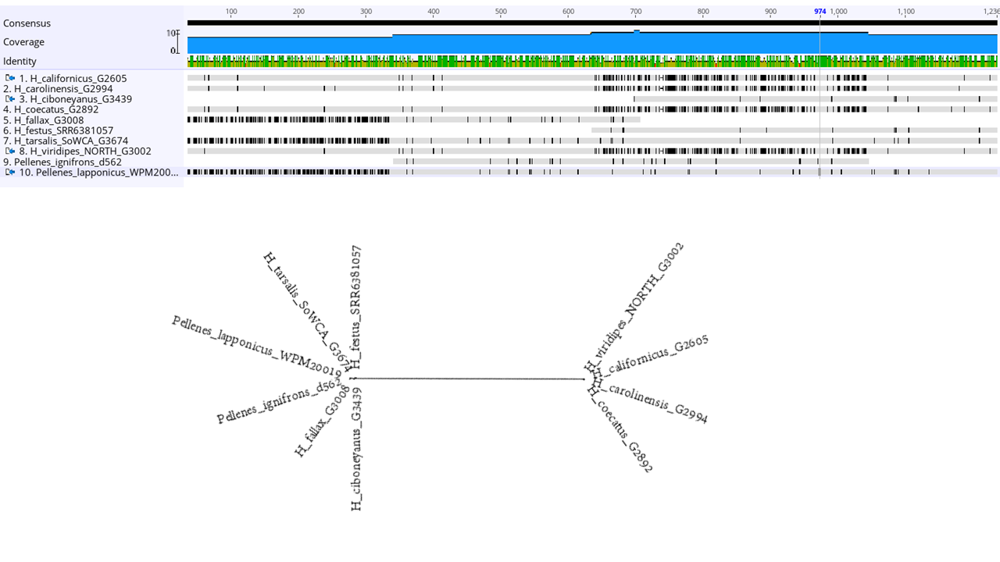

# PhyloTrascript Workflow
A workflow to generate phylogenies and SNP matrices for phylogenetics and population genomics from RNAseq data.  
[This is a work in progress]

This repository includes the scripts and custom programs used in the manuscript [**Azevedo et al. Name TBD**](https://).  
The workflow presented here can be used to re-run the analyses or to run a new analyses on different data by replacing the input files in this repository for your own files. To re-run the analyses download the raw reads from SRA using the list provided in the paper, replace the files in the [raw_reads](/raw_reads) folder and creates a map file . 
  
If you use any of the scripts or cutom programs please cite [**Azevedo et al. Name TBD**](https://) as well as the third party programs used (see below and in the help function of each program).
  
This pipeline were tested in a machine running the OS: Linux-3.10.0-957.10.1.el7.x86_64-x86_64-with-centos-7.6.1810-Core
and Ubuntu 18.04.4 LTS

## Programs, Scripts and Data  
  
You can clone the full repository and add the [*custom_programs_and_scripts*](/custom_programs_and_scripts) folder to your $PATH variable in your ~/.bashrc file or use the full path to the custom programs.
  
```bash
git clone git clone https://github.com/GHFAzevedo/PhylotransWorkflow

cd PhylotransWorkflow

#create a variable for the path to working directory folder
path_to_workdir=$(pwd)

## OPTIONAL: Add folder withe the scripts and programs to $PATH, but make a backup of the bashrc file before modifying it. 

cp ~/.bashrc mybash_backup
echo '
# >>> Path to custom_programs_and_scripts >>>
export PATH="'$PWD'/custom_programs_and_scripts:$PATH"
# <<< Path to custom_programs_and_scripts <<<' >> ~/.bashrc

source ~/.bashrc

# Add permission to execute the files
chmod +x $PWD/custom_programs_and_scripts/*.*
```
  
  
You also will need to install the folowing programs and versions (it may work with different versions but is not guaratee).  
- [Trimmomatic](http://www.usadellab.org/cms/?page=trimmomatic) v0.39  
- [FastQC](https://www.bioinformatics.babraham.ac.uk/projects/fastqc/) v0.11.9  
- [SPAdes](https://github.com/ablab/spades) v3.15.2  
- [CD-HIT](http://weizhong-lab.ucsd.edu/cd-hit/) v4.8.1  
- [phyluce](https://phyluce.readthedocs.io/en/latest/index.html) v1.7.1  
- [BUSCO](https://busco.ezlab.org/) v5.2.2  
- [seqtk](https://github.com/lh3/seqtk) v1.3-r106  
- [util-linux](https://man7.org/linux/man-pages/man1/rename.1.html) v2.36  
- [MAFFT](https://mafft.cbrc.jp/alignment/software/) v7.475  
- [CIAlign](https://github.com/KatyBrown/CIAlign) v1.0.18  
- [bioawk](https://github.com/lh3/bioawk) v1.0  
- [IQTREE](http://www.iqtree.org/) v2.1.2
- [TreeShrink](https://uym2.github.io/TreeShrink/) v1.3.7
- [GNU parallel](https://www.gnu.org/software/parallel/sem.html) v20220722
- [DendroPy](https://dendropy.org/) v4.5.2
- [bcftools](https://samtools.github.io/bcftools/) v1.11 (Installed with phyluce)
- [samtools](https://github.com/samtools/samtools) v1.11 (Installed with phyluce)
- [samtools](https://github.com/samtools/samtools) v1.15.1 (Needs to be installed in a differentenvironment)
- [vcftools](https://vcftools.github.io/index.html) v0.1.16
- [OrthoFinder](https://github.com/davidemms/OrthoFinder) v2.5.4  
- [BLAST](https://www.ncbi.nlm.nih.gov/books/NBK279690/) v2.12.0  
- [ASTRAL](https://github.com/smirarab/ASTRAL) v5.7.8
- [MitoFinder](https://github.com/RemiAllio/MitoFinder) v1.4  (you may need to configure the path to metaspades.py on the Mitofinder.config file)
- [entrez-direct](https://www.ncbi.nlm.nih.gov/books/NBK179288/) v.16.2

 
It migth be easier if you have all programs installed in one single conda environment. Follow the instructions for your platform that are available on the [miniconda website](https://docs.conda.io/en/latest/miniconda.html) to install conda. If you prefer to install them separately, skip the next part.
  
## Creating the Conda Environment and Installing Third Party Programs. 
(The version 1.7.1 of phyluce is not available for installing with conda. See intallation instruction the [phyluce website](https://phyluce.readthedocs.io/en/latest/index.html).)

```bash
conda create --name transcriptome
conda activate transcriptome
conda install -c bioconda trimmomatic=0.39
conda install -c bioconda fastqc=0.11.9
conda install -c bioconda spades=3.15.2
conda install -c bioconda cd-hit=4.8.1
conda install -c conda-forge -c bioconda busco=5.2.2
conda install -c bioconda seqtk=1.3
conda install -c conda-forge util-linux=2.36
conda install -c bioconda mafft=7.475
conda install -c bioconda cialign=1.0.18
conda install -c bioconda bioawk=1.0
conda install -c bioconda iqtree=2.1.2
conda install -c smirarab treeshrink=1.3.7
conda install -c bioconda dendropy=4.5.2
conda install -c bioconda vcftools=0.1.16
conda install -c bioconda orthofinder=2.5.4
conda install -c bioconda blast=2.12.0
conda install -c bioconda astral-tree=5.7.8
conda install -c bioconda mitofinder=1.4

#############################################################################
# edit Mitofinder.config file #
metaspades_path=$(which metaspades.py | sed "s/metaspades.py//g")
Mitofinderconfig_path=$(which Mitofinder.config)
to_replace=$(echo "metaspadesfolder = "$metaspades_path)
cp $Mitofinderconfig_path $Mitofinderconfig_path"_bkp"
awk -v old="metaspadesfolder = default" -v new="$to_replace" '{gsub(old,new); print}'  $Mitofinderconfig_path"_bkp" > $Mitofinderconfig_path
##############################################################################

conda -c bioconda entrez-direct=16.2

# the samtools v1.15.1 needs to be installed in a different environmet because of incompatibilities with phyluce-1.7.1
conda create --name samtoolsenv -c bioconda samtools=1.15.1
```


____________________________________________________________________

# The Phylotranscriptome Workflow

## Creating a folder for the outputs

```bash
mkdir outputs
cd outputs
```

## Cleanig raw reads

We used a custom program [*batch_read_cleaner.sh*](custom_programs_and_scripts/batch_read_cleaner.sh) that takes as input a folder with the raw read sequences and a text file that maps ecah read file to a final name for the cleaned read output separated by coma. The [*file raw_reads_map.txt*](input_files/raw_reads_map.txt) in the [input_files folder](input_files) contains an example of map file. It shoul look like this:
  
```
SRR1656783_1.fastq.gz,SRR1656783_1.fastq.gz,Genus_species_CODE01
SRR6381066_1.fastq.gz,SRR6381066_1.fastq.gz,Genus_species_CODE02
SRR6381077_1.fastq.gz,SRR6381077_1.fastq.gz,Genus_species_CODE03
SRR6381083_1.fastq.gz,SRR6381083_1.fastq.gz,Genus_species_CODE04
```
  
Run the custom program for batch processing the raw reads with Trimmomatic (change the number of threads with the flag -t).
  
```bash
batch_read_cleaner.sh -I ../input_files/raw_reads_map.txt -R ../raw_reads -a ../input_files/all_paired_adapters.fa -t 12
```
  
The configuration used in Trimmomatic was:  
PE -threads 16 ILLUMINACLIP:TranscriptomePipeline/input_files/all_paired_adapters.fa:2:30:10:2:keepBothReads LEADING:5 TRAILING:15 SLIDINGWINDOW:4:15 MINLEN:40
  
This is printed in the file *progress.txt* in the folder *log*. This configuration can be changed using flags of the program (type ```batch_read_cleaner.sh -h``` to see options) and/or changing line 165 of the file [batch_read_cleaner.sh](custom_programs_and_scripts/batch_read_cleaner.sh)

### Clened Reads Quality Control

We used [FastQC](https://www.bioinformatics.babraham.ac.uk/projects/fastqc/) to check the quality of the sequences afetr trimming and search for possible adapter contents and contaminats. Since this is RNAseq, the GC content will failed given the nature of the library (hexamer primers used for cDNA synthesis that may not aligned so randomly, giving initial peaks). Furthurmore, spiders usualy have low GC content (>40%). You can check the documentation and example reports on the [FastQC website](https://www.bioinformatics.babraham.ac.uk/projects/fastqc/) and some comments and suggestion on this [lesson page developed by the teaching team at the Harvard Chan Bioinformatics Core (HBC)](https://hbctraining.github.io/Intro-to-rnaseq-hpc-salmon-flipped/lessons/07_qc_fastqc_assessment.html).
  
You can mainly check the "Per base sequence quality", "Overrepresented sequences" (to check if some overrepresented sequence is a contamination) and "Adapter Content". The custom program take as input the folder output from batch_read_cleaner.sh (which has the same structure as the output by the illumiprocessor in the [phyluce](https://phyluce.readthedocs.io/en/latest/index.html) softwere for UCEs). It outputs in the log folder text files indicating wich samples had warnings or failed in the FastQC analyses so you can take a closer look at actual html fastQC output (if there is no file it means that in general they are fine). If some sample has problems, you can go back to next step and run Trimmomatic again with diffent parameters.

You can run the quality control simply:
```bash
batch_quality_control.sh -I clean_fastq
```
   
You can also check some stats with this function that uses a loop to run the [phyluce](https://phyluce.readthedocs.io/en/latest/index.html) program *phyluce_assembly_get_fastq_lengths*. If phyluce is in a different environment, do not forget to activate it before running. The function takes as argument the output folder with clean reads as before and outputs a csv file.

```bash
cleaned_reads_stats.sh clean_fastq
```


____________________________________________________________________
  
## Assembly

We assembled the cleaned reads with a custom bash program that call [SPAdes](https://github.com/ablab/spades) using the folowing configuration: --sc	--careful	--cov-cutoff	auto
  
The --sc mode of spades usually yields better results than the [rnaSPAdes](https://cab.spbu.ru/software/rnaspades/) or [Trinity](https://github.com/trinityrnaseq/trinityrnaseq/wiki) when the objective is find single copy orthologs ([Hölzer & Marz, 2019]( https://doi.org/10.1093/gigascience/giz039)). It also works well for UCEs libraries because of the irregular coverage of the genome and it is used in the [phyluce](https://phyluce.readthedocs.io/en/latest/index.html) softwere. We are also using the reverse-forward orientation common of RNAseq libraries. These options can be changed in the custon program (see ```batch_assembly_spades.sh -h ```).
  
The input folder needs to have the following structure:
```
    clean_reads
	  |
	  |_ Species_name_CODE01
	  |  |
	  |  |_split-adapter-quality-trimmed
	  |	   |
	  |    |Species_name_CODE01-READ1.fastq.gz
	  |    |Species_name_CODE01-READ2.fastq.gz
	  |    |Species_name_CODE01-READ-singleton.fastq.gz
	  |
	  |_ Species_name_CODE02
	  |  |
	  |  |_split-adapter-quality-trimmed
	  |	   |
	  |    |Species_name_CODE02-READ1.fastq.gz
	  |    |Species_name_CODE02-READ2.fastq.gz
	  |    |Species_name_CODE02-READ-singleton.fastq.gz
	  | 
```
This is the structured output by the *batch_read_cleaner.sh* and by Illuminprocessor program implemented in [phyluce](https://phyluce.readthedocs.io/en/latest/index.html). 
  
To run the customized program on the cleaned reads folder and assemble all samples with the above SPAdes configuration simply type (change the number of threads with the flag -t):

```bash
batch_assembly_spades.sh -I clean_fastq -o rf -t 12
```

### Removing Redundant Contigs

We used [CD-HIT](http://weizhong-lab.ucsd.edu/cd-hit/) v4.8.1 to remove very similar contigs that may represent isoforms. This also can reduce the number of contigs to speed up the next steps. We made a custom program that uses a loop to run CD-HIT in all files in a folder containing fasta files with contigs. The configuration used is: -c 0.95 -n 10 -M 0 -sf. This can be changed if needed. 
  
```bash
remove_redundancy.sh -I spades_contigs -c 0.95 -t 8
```

*Note 1*: If you ran [rnaSPAdes](https://cab.spbu.ru/software/rnaspades/) or [Trinity](https://github.com/trinityrnaseq/trinityrnaseq/wiki) you can use the program [get_longest_isoform_seq_per_trinity_gene.pl](https://github.com/trinityrnaseq/trinityrnaseq/tree/master/util/misc) available with [Trinity](https://github.com/trinityrnaseq/trinityrnaseq/wiki) to get the longest isoform.
  
*Note 2*: CD-HIT may not work well with long introns and short exons, which is the case with spiders. We don't know how much of these introns are retained in alternative splicing in spiders. However, SPAdes in single cell mode (--sc) usually groups isoforms into one contig ([Hölzer & Marz, 2019]( https://doi.org/10.1093/gigascience/giz039)). We expect that the combination os the assembled method and CD-HIT as well as the nex steps in this workflow would prevent to have isoforms treated as separate genes in the final alignments.


### Assembly Quality Control

You can compare the statistics before and after the cd-hit.
We used a custom function that runs *phyluce_assembly_get_fasta_lengths* in loop. The input is the folder with contigs.

```bash
assembly_stats.sh spades_contigs
assembly_stats.sh spades_contigs_cdhitfasta
```


____________________________________________________________________
  
  
## Single Copy Orthologs  
### BUSCO Orthologs
  
We we first used [BUSCO](https://busco.ezlab.org/) v5.2.2 to find single copy orthologs.

```bash
busco -i spades_contigs_cdhitfasta -o busco_outputs -m transcriptome -l arachnida_odb10  -c 12
```
  
Then we used a customized program to combine all the aminoacid ortologs output by BUSCO in a folder with one file per single copy ortholog gene. The progroma takes as input only the folder with the BUSCO results. It outputs two folders, one with only the complete BUSCO single copy and other that also includes the fragmented single copy (the output folder names are standard: *busco_aminoacid_seqs* and *busco_aminoacid_seqs_only_complete_BUSCO*)

```bash
combine_busco_aminoacids.sh busco_outputs
```
  
The custom function below removes all orthologs files with less than an specified number of species. You can use to create different completeness matrices. We used to remove all orthologs with less than 4 species.
  
The first argument is the input folder you want to filter, and the secong is the minimun number of sequences in the fasta file for it to be kept in the final output folder.
  
```bash
filter_by_min_n_seq.sh busco_aminoacid_seqs_singlecopy 4
filter_by_min_n_seq.sh busco_aminoacid_seqs_multicopy 4
```
The ouput can be aligned and used in phylogenetic analyses of aminoacid data. We used the nucleotide sequence instead, since it contains more variationa and more information in shallow phylogenetic depth. For that we need a custom program for retrieving the nucleotide sequences of the single copy orthologs.
  
#### BUSCO output statistics
  
You can run the BUSCO plot function to explore the statistics and quality of assemblies. The program *busco_plot.sh* prepares the folder with the BUSCO summary and run the BUSCO companion script *generate_plot.py* (see [BUSCO website](https://busco.ezlab.org/busco_userguide.html#outputs) for more information). The only argument needed for *busco_plot.sh* is a folder with the BUSCO outputs.
  
```bash
busco_plot.sh busco_outputs
```
 
The information in the output figure is also accessible in the file *batch_summary.txt* in the *busco_outputs* folder.
 
 
#### Retrieving Nucleotide Sequences of Single Copy Orthologs
  
The custom program *get_nucleotide_busco.sh* will retrieve the BUSCO contigs from each species and combine them into one fasta file per gene in the output folder called *busco_nucleotide_seqs*. 
Then, it separates the multicopy from the single copy genes in the dataset. 
(Note that one species migth present one cingle copy of a locus but other species migth have multiple copies of the same gene, which will make that gene multi copy in the dataset. So the lists would change according to the species that are or not included).  
The custom program It takes as input a folder with the contigs in fasta format, a folder with the output generated from a BUSCO run and the database used in the BUSCO run. Optionally you can provaide a prefix for the output folder (the default is busco_nucleotide_seqs). The default of the program retrieves complete and fragmented BUSCO contigs, but there is also an option to retrieve only the complete BUSCO (see ```get_nucleotide_busco.sh -h```)

It requires [seqtk](https://github.com/lh3/seqtk) v1.3-r106 and [util-linux](https://man7.org/linux/man-pages/man1/rename.1.html) v.2.36 to be installed in your system.

```bash
get_nucleotide_busco.sh -C spades_contigs_cdhitfasta -B busco_outputs -D arachnida_odb10
```
  
After retrienving the nucleotide sequences, we filtered for the genes having more than 3 species  
  
  
```bash
filter_by_min_n_seq.sh busco_nucleotide_seqs_singlecopy 4
filter_by_min_n_seq.sh busco_nucleotide_seqs_multicopy 4
```  
  
#### Aligning BUSCO Orthologs
  
We aligned the orthologs with [MAFFT](https://mafft.cbrc.jp/alignment/software/) v7.475 using the E-INS-i option (--genafpair) with --adjustdirectionaccurately  --maxiterate 1000. (Note: for UCEs the L-INS-i option (--localpair) migth be more appropriate than E-INS-i (--genafpair)). We use the custom program [*batch_align_mafft.sh*](custom_programs_and_scripts/batch_align_mafft.sh) that loop MAFFT over all fasta files in a folder. See ```batch_align_mafft.sh -h``` to see options of the custom program.

```bash
batch_align_mafft.sh -I busco_nucleotide_seqs_singlecopy_minseq4 -m E-INS-i -n 12 -j 2
```
The alignment algorithm used may be time and memory consuming, but it is more accurate.
You can use the options -j to run jobs in parallel and the -n to set the number of threads per job.


#### Cleaning BUSCO Alignments
  
We first cleaned alignments using CIAlign v1.0.18 to remove very divergent sequences, trim edges, remove insertions if present in less than percentage of samples, and remove short sequences (below a percentage threshold). The options used in CIAlign wer: --remove_divergent --remove_divergent_minperc 0.70 --remove_insertions --insertion_min_perc 0.25 --crop_ends --remove_short --remove_min_length  --make_consensus --visualise.
  
We created a program that takes as input the folder with alignmets and runs CIAlign in the fasta files, then it organizes the outputs in different folders. Some features of the CIAlign can be controled with the custom program [*clean_alignments_cialign.sh*](custom_programs_and_scripts/clean_alignments_cialign.sh) (see ``` clean_alignments_cialign.sh -h ``` for options). We ran the program with the above arguments typing:
  
```bash
clean_alignments_cialign.sh -A busco_nucleotide_seqs_singlecopy_minseq4_mafft -d 0.75 -i 0.25 -l 10 -j +0
```
The -j +0 indicates that parallel is going to use all CPU cores available to run parallel jobs.
  
We obtained alignment statistics and the count of loci per species using the [phyluce functions *phyluce_align_get_align_summary_data* and *phyluce_align_get_taxon_locus_counts_in_alignments*](https://phyluce.readthedocs.io/en/latest/daily-use/list-of-programs.html). We combined both functions and one single bash function that takes as input the folder with the alignments (make sure the phyluce environmet is activated). 

```bash
get_stats_fasta_alignments.sh busco_nucleotide_seqs_singlecopy_minseq4_mafft_CIAlign
```

We also used [GBLOCKS](http://molevol.cmima.csic.es/castresana/Gblocks/Gblocks_documentation.html) as implemented in [phyluce](https://phyluce.readthedocs.io/en/latest/index.html) to trim alignments.  

GBLOCKS Options

There are a few paramenters in Gblocks to choose:  
  b1  (default in phyluce: 0.50) Defines the minimum proportion threshold for a position to be considered conserved. Must be bigger than half the number of sequences. The bigger value, the lesser the selected number of positions.  
  b2  (default in phyluce: 0.85) Defines the minimum proportion threshold for a flank (higly conserved) position. Must be bigger than b1. The bigger value, the lesser the selected number of positions.  
  b3  (default in phyluce: 8) Defines the maximum number of contiguous nonconserved positions. All segments with contiguous nonconserved positions bigger than this value are rejected. The bigger value, the bigger the selected number of positions.  
  b4  (default in phyluce: 10) Defines the minimum length of block after gap cleaning. The bigger value, the lesser the selected number of positions.

We used the configuration below, but you should choose the parameters for your data
(Remember to activate phyluce environment)

```bash
phyluce_align_get_gblocks_trimmed_alignments_from_untrimmed \
    --alignments busco_nucleotide_seqs_singlecopy_minseq4_mafft_CIAlign \
	--output busco_nucleotide_seqs_singlecopy_minseq4_mafft_CIAlign_gblocks \
	--input-format fasta \
	--output-format fasta \
	--log-path logs \
	--cores 12 \
	--b1 0.50 \
	--b2 0.55 \
	--b3 10 \
	--b4 4
```
  
We then used phyluce to remove empty taxa and to keep only alignments with more than 3 taxa and >100bp
```bash
phyluce_align_remove_empty_taxa \
    --alignments busco_nucleotide_seqs_singlecopy_minseq4_mafft_CIAlign_gblocks \
    --output     busco_nucleotide_seqs_singlecopy_minseq4_mafft_CIAlign_gblocks_temp \
	--input-format fasta \
	--output-format fasta \
	--log-path logs \
	--cores 12
	
phyluce_align_filter_alignments \
    --alignments   busco_nucleotide_seqs_singlecopy_minseq4_mafft_CIAlign_gblocks_temp \
	--output       busco_nucleotide_seqs_singlecopy_minseq4_mafft_CIAlign_gblocks_filtered \
	--input-format fasta \
    --min-length   100 \
	--min-taxa     4 \
	--log-path     logs
	
# remove temp folder with empty taxa
rm -r busco_nucleotide_seqs_singlecopy_minseq4_mafft_CIAlign_gblocks_temp
```


#### TreeShrink
  
We used [TreeShrink](https://uym2.github.io/TreeShrink/) v1.3.7 to remove possible paralogs based on the length of branches in the gene trees.  
We created a program that runs IQTREE](http://www.iqtree.org/) v2.1.2 on the alignments using a GTR+F+G model to estimate gene trees, prepares the outputs in a folder structured folowing the requirements for [TreeShrink](https://uym2.github.io/TreeShrink/) and then it runs [TreeShrink](https://uym2.github.io/TreeShrink/), giving as output a folder with alignments with the longbranch taxa removed.  
For TreeShrink we used the parameters -q 0.20 -k 62. After trying different setings with a reduced dataset, I found this configuration as good for our data, since there seems to have many paralogs in the dataset. We suggest that you try to find the best TreeShrink configuration for your data.  
To see how to use our program, type ``` remove_paralogs_treeshrink.sh -h```. A list with the alignments which had and had not been modified will be saved to the files shrunk_alignment_list.txt and notshrunk_alignment_list.txt, respectively.
A summary of the number of tips removed and left by locus will be saved to treeshrink_summary_list.csv
  
```bash
remove_paralogs_treeshrink.sh -I busco_nucleotide_seqs_singlecopy_minseq4_mafft_CIAlign_gblocks_filtered -q 0.15 -t 14 -j 4
```  


We suggest that you check the alignments and trees (or at least a subsample of it) to make sure no alignments with paralog sequences pass to downstream analyses.
The program above should ouput a file called tree_before_after.tre and another called tree_loci_map.txt in the folder with suffix "_TreeShrink". You can use them to check the trees and go back to the alignment if needed. There is also two files with the list of trees that were shrunk and the ones that not shrunk (shrunk_alignment_list.txt and notshrunk_alignment_list.txt). If you think it is necessary, run TreeShrink again or remove sequences or alignments manually (reporting the alignments removed and why).  
We create a python program [find_long_branches.py](./custom_programs_and_scripts/find_long_branches.py) that search for disproportionaly long braches in a tree. We then used a bash script [screen_for_long_branches.sh](./custom_programs_and_scripts/screen_for_long_branches) to loop this program over the all folders in the TreeShrink result directory to screen for any long branchs that may have passed the TreeShrink filtering. The bash script takes as argument the TreeShrink output folder and the TreeShrink Shrunk Alignments. The output file with suffix "_check_alignments.txt" have a list of the alignments that have branches wich length correspond to 50% or more of the total tree length (this cam be changed modifying the argument "-p 0.5" in the line 12 of the bash script [screen_for_long_branches.sh](./custom_programs_and_scripts/screen_for_long_branches)). The program also outputs two folders with the suffix "_OK" and "_to_check".   

```bash
screen_for_long_branches.sh busco_nucleotide_seqs_singlecopy_minseq4_mafft_CIAlign_gblocks_filtered_TreeShrink \ busco_nucleotide_seqs_singlecopy_minseq4_mafft_CIAlign_gblocks_filtered_shrunk
```

We imported the folder with the suffix "_to_check" in Geneious Prime, looked at the trees and edited the files when necessary. For example, we removed the sequence H_pugillis_GALIU_36_07 in alignment 5440at6854 () . The alignment 1576at6854 were separated in 2 alignments: one with the sequences H_californicus_G2605, H_carolinensis_G2994, H_coecatus_G2892, and H_viridipes_NORTH_G3002, and the other with the remaining sequences () because it seemed to contain two different genes with similar sequences (probably a duplication event). The modified alignments were marked with the suffix "_edit.fasta" in the folder with the sufix "_checked".
We also import the folder with the suffix "_OK", ordered by % identity and looked at the trees and alignments for the genes with identy > 95%. We edited when necessary. All edited alignments are repported in the spreadsheet [busco_alignments_manually_edited.xlsx](./misc/busco_alignments_manually_edited.xlsx).


The alignments in this folder are ready for phylogenetic analyses using umphased data.
We renamed the folder for a simpler name.

```bash
mv busco_nucleotide_seqs_singlecopy_minseq4_mafft_CIAlign_gblocks_filtered_shrunk_edited Habro_busco_umphased
```
  
You can create different occupance matrix as desired with the same program used above or other.
You can also explore different taxa composition using phyluce program [*phyluce_align_extract_taxa_from_alignments*](https://phyluce.readthedocs.io/en/latest/daily-use/list-of-programs.html#phyluce-align-extract-taxon-fasta-from-alignments) or [*phyluce_align_filter_alignments*](https://phyluce.readthedocs.io/en/latest/daily-use/list-of-programs.html#phyluce-align-filter-alignments)  

We cretaed a 50%, 95%, 98% and 99% occupance matrices.
```bash
filter_by_min_n_seq.sh Habro_busco_umphased 62
mv Habro_busco_umphased_minseq62 Habro_busco_umphased_50p

filter_by_min_n_seq.sh Habro_busco_umphased 117
mv Habro_busco_umphased_minseq117 Habro_busco_umphased_95p

filter_by_min_n_seq.sh Habro_busco_umphased 121
mv Habro_busco_umphased_minseq121 Habro_busco_umphased_98p

filter_by_min_n_seq.sh Habro_busco_umphased 123
mv Habro_busco_umphased_minseq123 Habro_busco_umphased_99p
```

We got the stats for the final alignments using the custom program

```bash
get_stats_fasta_alignments.sh Habro_busco_umphased
```

____________________________________________________________________
#### Phasing

We used the [phyluce workflow for phasing](https://phyluce.readthedocs.io/en/latest/daily-use/daily-use-4-workflows.html), which uses samtools and pilon (already installed with phyluce). 
However, since we started from a internaly trimmed alignment as reference and we want a more robust snp calling, we changed the pilon comands so it does not try to correct indels. 
We also chaged the minimum depth from 5 to 10, so SNPs are only called if has more than ten reads of depth. Basically, we replaced the pilon commands "--fix snps, indels" by "--fix snps" and "--mindepth 5" by "--mindepth 10" in the SnakeFile file and created a new workflow folder and a new *phyluce_workflow* bin file. We also adde the path to this new workflow to the phyluce configuration file (phyluce.conf).   
If you installed the environment using the yaml avaliable here, it already contains the modified phyluce workflow file (*phyluce_workflow*) in the folder path_to_user's_conda_environment_folder/bin/. You can type ```which phyluce_workflow``` or ```phyluce_workflow --help``` to check if it is already installed (the option "phasingtrimmed" should be shoing for the "--workflow" flag.  
You also should see a folder called phasing_trimmed in the phyluce workflow directory with the modified snakefile (path_to_user's_conda_environment_folder/phyluce/workflows/phasing_trimmed/Snakefile).
If you don't have these files and folders, you can download the [modified workflow](), the [workkflow folder with the snakefile]() and the modified [phyluce.conf] files to phyluce bin, workflow and config directories, respectively).
You can also modify the SnakeFile yourself for the phasing workflow in the phyluce folder in the conda environment (go to  path_to_user's_conda_environment_folder/phyluce/workflows/phasing/Snakefile and replace "--fix snps, indels" by "--fix snps" and "--mindepth 5" by "--mindepth 10"). 
**CAUTION: this will modify the original phyluce workflow. If you want to use the default values again, you will need to remember to restore the original file. 
I suggest that you clone the environment before changing the file. If you installed the environments with the programs using the yaml file provided here, or if you downloaded the workflow files and folders to the correct place, you you have both originalnal ```phyluce_workflow --workflow phasing``` and the new ```phyluce_workflow --workflow phasingtrimmed```.** 
  
We first explode the alignments to create fasta files by taxa using the phyluce program *phyluce_align_explode_alignments*. We wraped the phyluce command into one customized bash program that takes as input the folder with alignments. We also get the by taxa statistics with the custom program that uses phyluce [phyluce_assembly_get_fasta_length](https://phyluce.readthedocs.io/en/latest/daily-use/list-of-programs.html#phyluce-assembly-get-fasta-lengths). 

```bash
explode_by_taxa.sh Habro_busco_umphased

get_species_stats.sh Habro_busco_umphased_bytaxa
```  

Note that one taxa (*H. paratus*) was filtered out of the final matrix. Always check the output folder of exploded sequences and stats.
In the next step, we will need the folder with the clean reads. Since the H. paratus sample is not in the final matrix, we removed the corresponding folder from the clean reads directory to avoid problems in the pipeline.

```bash
mkdir busco_filtered_clean_fastq
ln  clean_fastq/* busco_filtered_clean_fastq/
rm -r busco_filtered_clean_fastq/H_paratus_PNMA_SRR6381080
```  

We used a custom bash program prepares the configuration file and runs the phyluluce modified workflow for phasing.
The program takes as input the folder with clean reads and the exploded-by-taxa folder created in the previous step, outputing a folder with phased fasta files by taxa and by loci.
 
```bash
phase_trimmed_loci.sh -R busco_filtered_clean_fastq -C Habro_busco_umphased_bytaxa -n 20 -O Habro_busco
```
We need to meake some eddits in the fasta file headers to remove names added to the files (e.g "copy01") during the orthology checking.
```bash
sed -i "s/copy01_//g"  Habro_busco_phased_*/*.fasta
sed -i "s/copy02_//g"  Habro_busco_phased_*/*.fasta
sed -i "s/edit_//g"    Habro_busco_phased_*/*.fasta
```

##### Aligning Phased Sequences

The fasta files in the folders with phased loci can be aligned for phylogenetic analyses using phased information. 

```bash
batch_align_mafft.sh -I Habro_busco_phased_loci -m E-INS-i -n 12
```


____________________________________________________________________
#### Extracting SNPs

First we create a referece file (pseudo-reference) based on the consensus of the final alignment matrices (more specific the Habro_busco_umphased matrix in our case). We used CIAlign for creating a consensus with the options "--make_consensus". We create a bash program that runs CIAlign on the folder with alignments and outputs a folder with the final consensus in fasta format.

```bash
create_pseudoreference.sh -A Habro_busco_umphased -j +0 -o Habro_busco_umphased_consensus
```

We then map all cleaned fastq reads against this reference using bwa implemented in the [*phyluce_workflow*](https://phyluce.readthedocs.io/en/latest/daily-use/daily-use-4-workflows.html#mapping) for mapping. For that we just changed the configuration file to map all samples against the same reference, istead of mapping the reads against the contigs of its own corresponding sample.  
After that, we used [*bcftools*](https://samtools.github.io/bcftools/bcftools.html) and to call variants and filter low quality and low depth (<10 reads) snps with the commands "bcftools mpileup -A -a AD,DP -Ou -f {input.refer} {input.bam} | bcftools call -mv -Ov -f GQ | vcfutils.pl varFilter -Q 30 -d 10 > {output}". [vcftools](https://vcftools.github.io/man_latest.html) with the options "--vcf {input} --remove-indels --min-alleles 2 --max-alleles 2 --recode --recode-INFO-all --out {output}" was used to filter biallelic snps. We created a new workflow is implemented in the [modified phyluce_workflow program] using the flag "--vcfsnps", and using a configuration file that points to the folder with maped BAM files and to the reference. 
If you installed the environment using the yaml avaliable here, it already contains the modified phyluce workflow file (*phyluce_workflow*) in the folder path_to_user's_conda_environment_folder/bin/. You can type ```which phyluce_workflow``` or ```phyluce_workflow --help``` to check if it is already installed (the option "vcfsnps" should be showing for the "--workflow" flag.  
You also should see a folder called vcfsnps in the phyluce workflow directory with the modified snakefile (path_to_user's_conda_environment_folder/phyluce/workflows/vcfsnps/Snakefile). 

The bash program [call_snps_using_reference.sh](./custom_programs_and_scripts/call_snps_using_reference.sh) automatically prepares the configuration files for the mapping and for the vcfsnp workflows, and run them taking as input the folder with the clean reads (trimmomatic output) and the reference file created in the previous step.

```bash
call_snps_using_reference.sh -R busco_filtered_clean_fastq -C Habro_busco_umphased_consensus/pseudoreference.fasta -O Habro_busco -n 12 

# Sompress vcf files
bgzip Habro_busco_snps/calls/variants.vcf
bgzip Habro_busco_snps/calls/biallelic.vcf.recode.vcf
``` 
____________________________________________________________________


#### Organizing BUSCO results
  
Copy all results related to BUSCO to a folder called *busco_orthology_results* and copy the final matrices to be used for analyses to the *final_matrices* folder
You also can delete some intermediate results folders to release disc space. 

```bash
mkdir final_matrices
mv Habro_busco_phased_loci_mafft final_matrices/Habro_busco_phased_loci_mafft
mv Habro_busco_umphased final_matrices/Habro_busco_umphased

mkdir final_matrices/Habro_busco_snps
mv Habro_busco_snps/calls/biallelic.vcf.recode.vcf.gz final_matrices/Habro_busco_snps/Habro_busco_snps_biallelic.vcf.gz

# Double check before removing thrm
rm -rf Habro_busco_phased_output \
       Habro_busco_umphased_bytaxa_mapped \
       Habro_busco_ref_mapped \
	   busco_nucleotide_seqs_singlecopy_minseq4_mafft_CIAlign_gblocks_filtered_shrunk_OK \
	   busco_nucleotide_seqs_singlecopy_minseq4_mafft_CIAlign_gblocks_filtered_shrunk_to_check \
	   busco_nucleotide_seqs_singlecopy_minseq4_mafft_CIAlign_images 

mkdir orthology_results_busco
mv busco_* orthology_results_busco/
mv *_busco_* orthology_results_busco/
```
  
____________________________________________________________________


### OrthoFinder Orthologs

  
We also used [OrthoFinder](https://github.com/davidemms/OrthoFinder) to find ortholog gene families and use the single copy for phylogenetics. We did this because *Habronattus* has a big genome (~5Gb) and there is no close reference genome available for the genus. The Aarchnida BUSCO database migth be missing some important genes in *Habronattus*.

Before running Orthofinder, we need to rename the fasta headers in the contigs folder to include the name of the species. We used the custom program that takes as input the folder with fasta files.

```bash
add_sp_names_to_fasta_headers.sh spades_contigs_cdhitfasta
```
  
There is no need to run the entire OrthoFinder analysis, since it can take a while. You can stop after findig the Orthogroups (-og). If you have few samples, it migh be interesting to see all OrethoFinder results, though (see [OrthoFinder manual](https://github.com/davidemms/OrthoFinder) for details). The processing migth be intensive, specially if you have many samples. It may be necessary to adjust some configurations in your system so orthofinder can better use the memory and open all the files (see this [page](https://github.com/davidemms/OrthoFinder/issues/384) for example). 
  
We run OrthoFinder with the commands below (change -t and -a for the number of threads used) 
```bash
orthofinder -d -f spades_contigs_cdhitfasta_renamed -t 20 -a 5 -og -o ./orthology_results_orthofinder
```
And organize the folders to simplify the next steps
```bash
mv orthology_results_orthofinder/Results_*/* orthology_results_orthofinder/
rm -r orthology_results_orthofinder/Results_*
```
The number of files in the Orthogroup_Sequences folder migth be very big and your browser may crash if you try to open it. The number of files in the Single_Copy_Orthologue_Sequences may vary dependning on the numberof species you have and how distant phylogenetic they are. The smaller the number of species and the closest their relationships, the more single copy you may have. You can count the number of orthogroups with the code below:
  
```bash
ls -1 orthology_results_orthofinder/Orthogroup_Sequences | wc -l
ls -1 orthology_results_orthofinder/Single_Copy_Orthologue_Sequences | wc -l
```
  
Note: Orthofinder results can be influenced by the samples included. If you have some doubts about the quality of some samples, it might be better to remove them. Since it is easy to remove or add samples after a first run, you can perform a intial analyses with all the samples and then remove some samples later to compare. You can also remove distant related outgroups (see [OrthoFinder page](https://github.com/davidemms/OrthoFinder#removing-species) for more information.

OrthoFinder only outputs to the *Single_Copy_Orthologue_Sequences* folder the single copy orthologs that are present in all (or almost all species). That folder could be empty if you have very divergent samples (like distant related species or some bad quality samples). However, there are single copy orthologs that are not present in all species in the folder *Orthogroup_Sequences*. We used the custom bash program to retrieve all these single copy orthologs with incomplete taxa occupancy. This program takes as input a folder with OrthoFinder result and the number of species expected in a 100% occupancy (see ```find_incomplete_single_copy_orthogroups.sh -h``` for details). The output is a folder with all single copy orthologs with incomplete taxa occupancy. Since there migth be a lot of orthogroups, this can take a while. We also add a code before executing the program to create a variable with the number os species in the contigs folder, so we can pass it to the flag "-N" in the custom program without the need to count it manually.

```bash
number_of_species=$(ls -1 spades_contigs_cdhitfasta_renamed | wc -l)
find_incomplete_single_copy_orthogroups.sh -I orthology_results_orthofinder -N $number_of_species
```

#### Filtering OrthoFinder othologs by minimun number of species
  
We modified the program for filtering so it can work using as input the orthofinder output folder (because of the amount of genes, the *ls* command may not work). The second argument is the minimum number of sequences for the orthogroup to be kept.

```bash
filter_by_min_n_seq_orthofinder.sh orthology_results_orthofinder/Orthogroup_Sequences_Incomplete_Single_Copy 31

```


#### Aligning OrthoFinder Orthologs
  
We aligned the Orthofinder orthogroups the same way we aligned the BUSCO orthogroups.

```bash
batch_align_mafft.sh -I Orthogroup_Sequences_Incomplete_Single_Copy_minseq31 -m E-INS-i -n 56 -j 2 -o 
```


#### Cleaning OrthoFinder Alignments
  
Alignment cleaning was done in the same way it was done for the BUSCO orthologs.
  
```bash
clean_alignments_cialign.sh -A Orthogroup_Sequences_Incomplete_Single_Copy_minseq31_mafft -d 0.75 -i 0.25 -l 10 -j +0
```

##### Removing Possible Contaminants in OrthoFinder Alignments

Since reference transcriptome is not used in OrthoFinder, and the RNAseq sequences might contain RNA from parasites, symbiontes and contaminants. We removed alignments that matched with the BUSCO database of Alveolata, Bacteria, Euglenozoa, Fungi and Nematoda. We first create a pseudoreference using the conseunsus of each alignment to facilitate search. We used a custom program that uses [CIAlign](https://github.com/KatyBrown/CIAlign) to get the pseudoreference.


```bash
create_pseudoreference.sh -A Orthogroup_Sequences_Incomplete_Single_Copy_minseq31_mafft_CIAlign -j +0 -o pseudo_reference_for_decontamination
```
  
We created the bash progam [*decontaminate_ortho.sh*](custom_programs_and_scripts/decontaminate_ortho.sh) that takes the pseudoreference folder created above and the folder with alignments as arguments. It outputs a file with all alignments that don't match the database (decontaminated alignments).  

```bash
decontaminate_ortho.sh pseudo_reference_for_decontamination Orthogroup_Sequences_Incomplete_Single_Copy_minseq31_mafft_CIAlign
```

Only six alignments matched the database. These sequences might belong to very conserved genes shared by those organisms and spiders, or it might be the transcript of some comon parasite/symbiont. We took a more conservative view and assumed they were not spiders' sequences.
  

As before, we also used [GBLOCKS](http://molevol.cmima.csic.es/castresana/Gblocks/Gblocks_documentation.html) as implemented in [phyluce](https://phyluce.readthedocs.io/en/latest/index.html) to trim alignments. But before, we need remove unnecessary information from the fasta sequence headers.

```bash
sed -i "s/ .*//g" Incomplete_Single_Copy_minseq31_mafft_CIAlign_decontaminated/*.fasta

# we also rename the input folder to a shorter name since phyluce can have trouble with long folder names

mv Orthogroup_Sequences_Incomplete_Single_Copy_minseq31_mafft_CIAlign_decontaminated Incomplete_Single_Copy_minseq31_mafft_CIAlign_decontaminated

phyluce_align_get_gblocks_trimmed_alignments_from_untrimmed \
    --alignments Incomplete_Single_Copy_minseq31_mafft_CIAlign_decontaminated \
	--output Incomplete_Single_Copy_minseq31_mafft_CIAlign_decontaminated_gblocks2 \
	--input-format fasta \
	--output-format fasta \
	--log-path logs \
	--cores 12 \
	--b1 0.50 \
	--b2 0.55 \
	--b3 10 \
	--b4 4
```
  
We then used phyluce to remove empty taxa and to keep only alignments with more than 3 taxa and >100bp
```bash
phyluce_align_remove_empty_taxa \
    --alignments Incomplete_Single_Copy_minseq31_mafft_CIAlign_decontaminated_gblocks \
    --output     Incomplete_Single_Copy_minseq31_mafft_CIAlign_decontaminated_gblocks_temp \
	--input-format fasta \
	--output-format fasta \
	--log-path logs \
	--cores 12
	
phyluce_align_filter_alignments \
    --alignments   Incomplete_Single_Copy_minseq31_mafft_CIAlign_decontaminated_gblocks_temp \
	--output       Incomplete_Single_Copy_minseq31_mafft_CIAlign_decontaminated_gblocks_filtered \
	--input-format fasta \
    --min-length   100 \
	--min-taxa     4 \
	--log-path     logs
	
# remove temp folder with empty taxa
rm -r Incomplete_Single_Copy_minseq31_mafft_CIAlign_decontaminated_gblocks_temp
```


#### Searching Mitochondrial Orthogroups

We used BLAST v2.12.0 to search the OrthoFinder orthogroups that are from the mitochondrial genome and separate them from the uclear genome. We used the mitochondrial genome of *Habronattus oregonensis* GenBank number [AY571145.1](https://www.ncbi.nlm.nih.gov/nuccore/AY571145.1?report=genbank#sequence_AY571145.1) as subject and the consensus of each alignment as query. The default BLAST parameters were used, except for -max_target_seqs which was set to 1 (therefore, BLAST will print "Warning: [blastn] Examining 5 or more matches is recommended", but it can be ignored). We made a custom program that takes as input the query and subject fasta files and a folder with the alignments, and outputs the two folders, one with the nuclear and the other with the mitochondrial alignments.

```bash
filter_mitochondrial.sh  pseudo_reference_for_decontamination/pseudoreference.fasta ../../input_files/H_oregonensis_mitochondrial.fasta Incomplete_Single_Copy_minseq31_mafft_CIAlign_decontaminated_gblocks_filtered
```

**Note**: We did not find any mitochondrial gene in the alignments folder. You could use the alingments in the folder with sufix "*_mito*" for a mitochondrial phylogeny. The file *mitochondria_blastresult.txt*  have the information to link each OrthoFinder alignments to the specific mitochondrial gene. However, we found that using our protocol below yields better mitochondrial alignments (see below).	


#### Removing long branches with TreeShrink
  
We used [TreeShrink](https://uym2.github.io/TreeShrink/) v1.3.7 to remove possible paralogs based on the length of branches in the gene trees as done for the BUSCO alignments. 

  
```bash
remove_paralogs_treeshrink.sh -I Incomplete_Single_Copy_minseq31_mafft_CIAlign_decontaminated_gblocks_filtered_nuclear -q 0.10 -t 14 -j 4
```   

Again, the same processed for checking the BUSCO alignments was performed for the OrthoFinder orthologs.  

```bash
screen_for_long_branches.sh Incomplete_Single_Copy_minseq31_mafft_CIAlign_decontaminated_gblocks_filtered_nuclear_TreeShrink \ Incomplete_Single_Copy_minseq31_mafft_CIAlign_decontaminated_gblocks_filtered_nuclear_shrunk
```

Only 16 alignments were marked for inspection. Since the number of alignments in the 25% occupance matrix is considerable (2798 alignments), we simply removed the ones marked for inspection.

We renamed the folder for a simpler name.

```bash
mv Incomplete_Single_Copy_minseq31_mafft_CIAlign_decontaminated_gblocks_filtered_nuclear_shrunk_OK Habro_orthofinder_umphased
```

We cretaed a 50%, 95%, 98% and 99% occupance matrices.
```bash
filter_by_min_n_seq.sh Habro_orthofinder_umphased 62
mv Habro_orthofinder_umphased_minseq62 Habro_orthofinder_umphased_50p

filter_by_min_n_seq.sh Habro_orthofinder_umphased 117
mv Habro_orthofinder_umphased_minseq117 Habro_orthofinder_umphased_95p

filter_by_min_n_seq.sh Habro_orthofinder_umphased 121
mv Habro_orthofinder_umphased_minseq121 Habro_orthofinder_umphased_98p

filter_by_min_n_seq.sh Habro_orthofinder_umphased 123
mv Habro_orthofinder_umphased_minseq123 Habro_orthofinder_umphased_99p
```

We got the stats for the final alignments using the custom program

```bash
get_stats_fasta_alignments.sh Habro_orthofinder_umphased
```


We removed unnecessary files produced during the decontamination steps and others.

```Bash
#Double check commands and folders before runing it.
rm -rf contaminants_* \
       busco_downloads \
	   pseudo_reference_for_decontamination \
       Orthogroup_Sequences_Incomplete_Single_Copy_minseq31_mafft_CIAlign_images

```

  
____________________________________________________________________
#### Phasing - OrthoFinder Orthologs

Phasing procedures were the same as performed for BUSCO orthologs.

```bash
explode_by_taxa.sh Habro_orthofinder_umphased

get_species_stats.sh Habro_orthofinder_umphased_bytaxa
```  

Since no species was filtered out, we used the original clean-fastq folder.

```bash
phase_trimmed_loci.sh -R ../clean_fastq -C Habro_orthofinder_umphased_bytaxa -n 20 -O Habro_orthofinder

#remove unecessary files. Double check it before running
rm -rf Habro_orthofinder_phased_output \
       Habro_orthofinder_mapped

```  


##### Aligning Phased Sequences


```bash
batch_align_mafft.sh -I Habro_orthofinder_phased_loci -m E-INS-i -n 12
```


____________________________________________________________________

#### Extracting SNPs - OrthoFinder Orthologs

```bash
create_pseudoreference.sh -A Habro_orthofinder_umphased -j +0 -o Habro_orthofinder_umphased_consensus

call_snps_using_reference.sh -R ../clean_fastq -C Habro_orthofinder_umphased_consensus/pseudoreference.fasta -O Habro_orthofinder -n 12 

```


____________________________________________________________________


#### Organizing OrthoFinder results

```bash
cd 
mv Habro_orthofinder_phased_loci_mafft ../final_matrices/Habro_orthofinder_phased_loci_mafft
mv Habro_orthofinder_umphased ../final_matrices/Habro_orthofinder_umphased

mkdir ../final_matrices/Habro_orthofinder_snps
mv Habro_orthofinder_snps/calls/biallelic.vcf.recode.vcf.gz ../final_matrices/Habro_orthofinder_snps/Habro_orthofinder_snps_biallelic.vcf.gz

rm -rf Habro_orthofinder_ref_mapped \
       Habro_orthofinder_snps/bams \
    
```


____________________________________________________________________


### SNPs Based on Reference Genome

There is nos assembled genoe of Habronattus for mapping reads and stablish orthology. The closest reference genome is 
[*Dolomedes plantarius*](https://www.ncbi.nlm.nih.gov/data-hub/genome/GCA_907164885.1/). We use this genome as reference to map *Habronattus* reads. 

```bash
cd $path_to_workdir/outputs

wget https://ftp.ncbi.nlm.nih.gov/genomes/all/GCA/907/164/885/GCA_907164885.1_qDolPla1.1/GCA_907164885.1_qDolPla1.1_genomic.fna.gz

gzip -d GCA_907164885.1_qDolPla1.1_genomic.fna.gz  
mv GCA_907164885.1_qDolPla1.1_genomic.fna Dolomedes_plantarius_refgen_GCA_907164885.fasta

call_snps_using_reference.sh -R clean_fastq -C Dolomedes_plantarius_refgen_GCA_907164885.fasta -O Habro_genomemapped -n 12 

```


____________________________________________________________________


## Mitochondrial Genome

For the mitochondrial genomes, we first used the [bwa mem] for mapping the clened reads against a fasta file with the complete mitochondrial genome of [*Habronattus oregonensis*](https://www.ncbi.nlm.nih.gov/nuccore/AY571145.1).
The fasta file with modified sequence headers is [here](./input_files/H_oregonensis_mitogenes.fasta).
Then, we used [samtools consensus](http://www.htslib.org/doc/samtools-consensus.html) in all bam files resultant from the mapping.  

Since the version of samtools which has the consensus function has conflic with the samtools used by phyluce, we installed the version 1.15.1 of samtools in a new environment.

We created a custom bash program that performs this tasks and outputs the fatas files in a separate folder. It takes as input the folder with cleaned reads and the fasta file with the target sequences to be used as reference.
It is also necessary to provide the name of the conda environments for phyluce and samtools with the flags -p and -s respectively

**Note**: We noticed that this method works better when there is a close related species for reference. So we only performed this for the **Habronattus** samples.

```bash
cd $path_to_workdir/outputs
mkdir Habro_mitochondrial
cd Habro_mitochondrial
mkdir clean_fastq_habro
cd clean_fastq_habro

cp -rs ../../clean_fastq/H_* .
cd ..


bycatch_genes.sh -R clean_fastq_habro -O mitogenes_habro -C ../../input_files/H_oregonensis_mitogenes.fasta -b transcriptome -s samtoolsenv -n 10 -j 2
```

For *Pellenes* and *Pellenattus* samples, we first retrieved the mitogenome of Pellenattus_canadensis_SRR6381075 using [MitoFinder](https://github.com/RemiAllio/MitoFinder) on transcripts previously assembled with Trinity. Then we map the other samples againts that reference mitogenome of [Pellenattus_canadensis_SRR6381075](./input_files/Pellenattus_canadensis_SRR6381075_mitogenes.fasta)

```bash

mkdir clean_fastq_pelle
cd clean_fastq_pelle

cp -rs ../../clean_fastq/Pell* .
cd ..

bycatch_genes.sh -R clean_fastq_pelle -O mitogenes_pelle -C ../../input_files/Pellenattus_canadensis_SRR6381075_mitogenes.fasta -b transcriptome -s samtoolsenv -n 10 -j 2
```

We retrieve mitogenes from Ecarcha mapping against a [fasta file](./input_files/Epeus_alboguttatus_MH922026_mitogenes.fasta) with the mitogenome of [Epeus alboguttatus MH922026](https://www.ncbi.nlm.nih.gov/nuccore/MH922026.1).


```bash
mkdir clean_fastq_evarcha
cd clean_fastq_evarcha

cp -rs ../../clean_fastq/Evarcha* .
cd ..

bycatch_genes.sh -R clean_fastq_evarcha -O mitogenes_evarcha -C ../../input_files/Epeus_alboguttatus_MH922026_mitogenes.fasta -b transcriptome -s samtoolsenv -n 20 -j 1
```

We then combined all sequences by gene.

```bash
mkdir mitogenes_fastas_by_gene

for file in $(ls mitogenes_habro_fastas_by_gene/*.fasta)
  do
   cat $file mitogenes_pelle_fastas_by_gene/$(basename $file) mitogenes_evarcha_fastas_by_gene/$(basename $file) >> mitogenes_fastas_by_gene/$(basename $file)
done
```  

### Aligning mitochondrial genome

```bash
batch_align_mafft.sh -I mitogenes_fastas_by_gene -m E-INS-i -n 10 -j 2
```bash

#### Trimming mitochondrial alignments

```bash
phyluce_align_get_gblocks_trimmed_alignments_from_untrimmed \
    --alignments mitogenes_fastas_by_gene_mafft \
	--output mitogenes_fastas_by_gene_mafft_gblocks \
	--input-format fasta \
	--output-format fasta \
	--log-path logs \
	--cores 12 \
	--b1 0.50 \
	--b2 0.55 \
	--b3 10 \
	--b4 4
```
Copying the alignments to the final matrices folder

```bash
mv mitogenes_fastas_by_gene_mafft_gblocks ../final_matrices/Habro_mitogenes_mafft_gblocks
``` 

Remove bam files to release disc space
```bash
rm -rf *_bam
rm -r clean_fastq_*
``` 

____________________________________________________________________

## Phylogenetic Analysis

With the final matrices ready, we can start the phylogenetic analyses.


### Concatenated maximum-likelihood phylogeny

We used [IQTREE](http://www.iqtree.org/) for the concatenated aligments

```bash
cd $path_to_workdir

mkdir concatenated_phylogenies
cd concatenated_phylogenies

mkdir Habro_busco_umphased_50p_concat
cd Habro_busco_umphased_50p_concat
iqtree -p ../../final_matrices/Habro_busco_umphased_50p -m MFP --mrate I,G,I+G -mset mrbayes -T 4 --prefix Habro_busco_umphased_50p -B 1000 --alrt 1000
cd ..


mkdir Habro_orthofinder_umphased_concat
cd Habro_orthofinder_umphased_concat
iqtree -p ../../final_matrices/Habro_orthofinder_umphased -m MFP --mrate I,G,I+G -mset mrbayes -T 4 --prefix Habro_orthofinder_umphased -B 1000 --alrt 1000

# Note: The Habro_orthofinder_umphased matrix is a 50% occupance matrix


mkdir Habro_mitogenes_mafft_gblocks_concat
cd Habro_mitogenes_mafft_gblocks_concat
iqtree -p ../../final_matrices/Habro_mitogenes_mafft_gblocks -m MFP --mrate I,G,I+G  -mset mrbayes --merge -T 4 --prefix Habro_mitogenes -B 1000 --alrt 1000

```


### Coalescence based phylogeny

We used [IQTREE](http://www.iqtree.org/) for infering gene trees and [ASTRAL](https://github.com/smirarab/ASTRAL) for the species trees. We infer the species trees for the phased and unphased data. We used a custom program to loop IQTREE over the folder with alignments. The program take as arguments the path to the folder, the number of threats to be used by IQTREE and the number of parallel jobs.

IQTREE commands were "iqtree -s $i -m MFP -mset mrbayes --mrate I,G,I+G -T $threads -B 1000" 

```bash

mkdir coalescent_phylogenies
cd coalescent_phylogenies 

infer_gene_trees_iqtree.sh ../final_matrices/Habro_busco_umphased 2 28

infer_gene_trees_iqtree.sh .../final_matrices/Habro_busco_phased_loci_mafft 2 28

infer_gene_trees_iqtree.sh ../final_matrices/Habro_orthofinder_umphased 2 28

infer_gene_trees_iqtree.sh ../final_matrices/Habro_orthofinder_phased_loci_mafft 2 28
``` 

We ran ASTRAL on the unphased trees using the flags -t 3 and -t 8 to output the posterior support and the quartet scores as branch annottations.


```bash

astral -i Habro_busco_umphased_gene_trees.nwck -o Habro_busco_umphased_astral_posteriorsupport.tre -t 3

astral -i Habro_busco_umphased_gene_trees.nwck -q Habro_busco_umphased_astral_posteriorsupport.tre -o Habro_busco_umphased_astral_quartscore.tre -t 8


astral -i Habro_orthofinder_umphased_gene_trees.nwck -o Habro_orthofinder_umphased_astral_posteriorsupport.tre -t 3

astral -i Habro_orthofinder_umphased_gene_trees.nwck -q Habro_orthofinder_umphased_astral_posteriorsupport.tre -o Habro_orthofinder_umphased_astral_quartscore.tre -t 8

```

For the phased data we first created a map file and then run ASTRAL as before.

```bash

# Automatic create the map file based on the clean_fastq folders

for i in $(ls ../clean_fastq)
  do
    echo $(basename $i)":"$(basename $i)"_p0,"$(basename $i)"_p1" >> astral_name_map.txt
 done


#run astral 

astral -i Habro_busco_phased_loci_mafft_gene_trees.nwck -o Habro_busco_phased_astral_posteriorsupport.tre -t 3 -a astral_name_map.txt

astral -i Habro_busco_phased_loci_mafft_gene_trees.nwck -q Habro_busco_phased_astral_posteriorsupport.tre -o Habro_busco_phased_astral_quartscore.tre -t 8 -a astral_name_map.txt


astral -i Habro_orthofinder_phased_loci_mafft_gene_trees.nwck -o Habro_orthofinder_umphased_astral_posteriorsupport.tre -t 3 -a astral_name_map.txt

astral -i Habro_orthofinder_phased_loci_mafft_gene_trees.nwck -q Habro_orthofinder_phased_astral_posteriorsupport.tre -o Habro_orthofinder_phased_astral_quartscore.tre -t 8 -a astral_name_map.txt

```

____________________________________________________________________

## Introgression

